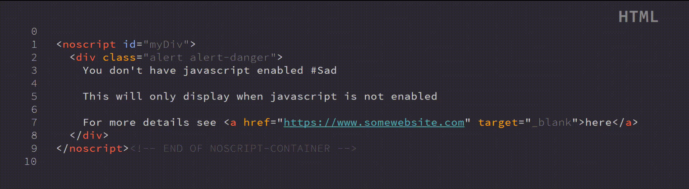

# ft-syntax-highlight
A lightweight, **pure CSS** syntax-highlighter; no Javascript required. A syntax-highlighter with 8 custom built-in UI themes like dark, light, simple, burberry, midnight, bootstrap and more! Common-sense tagging, line numbers and custom, pure CSS tooltips for identifying elements! Supports all major browsers and HTML versions. Made specifically for those pure CSSers like me!



# Table of Contents:

| Point of Interest | Description |
| ---| ---|
| [Getting Started](#getting-started) | How to link to project & recommended usage |
| [About](#about) | Review the mission of this project & learn about the benefits of a pure CSS syntax highlighter over automated counterparts |
| [Understanding Selectors](#understanding-selectors) | Overview of why the tagging system is structured as it stands & best practices |
| [Support](#support) | Detail overview of supported languages, features, UI themes, syntax themes and browsers |
| [Road Map](#road-map) | Outlined vision and plans for future languages |
| [Technical Specs](#technical-specs) | Any relevant under-the-hood stuff; font used, fallbacks etc |
| [License](#license) | |
| [Links](#links) | Links to non-project related resources |

## Getting Started
[[top]](#table-of-contents)

#### Disclaimer:
>Due to the nature of this libraries scalable potential, the .css files structure is explicitly focused on organization, not so much on short-hand practices. Therefore, you will see, in most cases, selectors are not compounded, but individually styled based on its respective language.

The bare minimum for using ft-syntax-highlighter on a web page is linking to the library and adding a class selector to your ```<pre>``` tag:

```html
<link rel="stylesheet" href="css/ft-syntax-highlight.css">
```
We recommend downloading the file and placing it in your projects directory for offline use or otherwise.

**Linking to GitHub path directly.** Because of the nature of the project, the library is supported to work straight
from the source. However, we assume you understand the risks of using this method provided source code changes or files are altered without notice.

After you've added the class to your ```<pre>``` tag you must identify the syntax using our `data` attributes for respective supported languages:

```html
<pre class="ft-syntax-highlight" data-syntax="html" ... >
  <code>
  ...
```
This will initiate proper tooltips for the respective selection. 

For syntax highlighting, you can pick from any of the syntax highlighting themes:
```html
<pre class="ft-syntax-highlight" data-syntax="html" data-syntax-theme="one-dark">
  <code>
  ...
```
Please note, that highlighting **ONLY** occurs in the `code` tag and there is **NO** default. 

You can also specify a UI theme if you don't want the default dark theme.

**Example**

```html
<pre class="ft-syntax-highlight" data-syntax="html" data-syntax-theme="one-dark">
  <code>
  <span class="comment">&lt;!-- This is a single line HTML comment --&gt;</span>
  </code>
</pre>
```

It is **highly recommended** you don't nest `<pre class="ft-syntax-highlight>` tags. We can't foreshadow all use-cases, but we did a simple validation to attempt in eliminating this practice.

The list of supported languages can be found [below](#support)

## About 
[[top]](#table-of-contents)

This project is simply targeted to those hard-core pure CSSers like me!

The goal of this library is to provide a Javascript-independent syntax-highlighter with common-sense tagging. This library will always be Javascript-independent! 

**Why pure CSS syntax-highlighter? Won't that create more work for me than necessary?**
Indeed, although a pure CSS syntax-highlighter would mean a little more busy-work on your end as a developer, we can guarantee all users get the best experience, even if only 2% of internet users have Javascript disabled.

Essentially, this library focuses on [Progressive Enhancement](https://en.wikipedia.org/wiki/Progressive_enhancement) and it's our mission to not discriminate against disablers, but support all users.

We encourage users to build Javascript integration if it fits within the scope of their needs, however, this specific library will always be Javascript-independent. 

## Understanding Selectors
[[top]](#table-of-contents)

`<pre>` tag attributes:
- `data-syntax`       : defines the langauge tooltip and UI title | no default | accepts any supported language
- `data-syntax-theme` : defines the syntax highlighting theme | defaults to UI themes color | list can be found [here](examples#syntax-themes)
- `data-ui-theme`     : (optional) changes the UI of the `pre` tag | defaults to "dark" | list can be found [here](examples#ui-themes)
- `data-showTooltips` : (optional) display tooltips on hover | defaults to false | accepts "true"

Usage:
`<pre class="ft-syntax-highlight" data-syntax="css" data-syntax-theme="one-light" data-showTooltips="true">...</pre>`

**BASICS**

What we mean by 'common-sense' tagging is simply put, keeping things as natural as possible. The end goal is to isolate elements on a per-language basis, while somehow trying to make all other languages tagging familiar so you’re not learning 20,000 different classes/tags. 

For example, considering XML is a low-level language, it's elements are broken down simply to elements, attributes, attribute values, namespaces and comments. Those are exactly what we use for tags in this scenario.

However, consider Javascript as a higher-level language, there are multiple elements that could define an 'element' or 'variable' or 'selector'. We specifically oversimply the lingo in this regard so we aren't coding for astronomical amounts of identifiers. Variables, functions as variables, local variables etc. can all be targeted with a `<span class="identifier">` tab. And the same is true for jQuery, and PHP. 

Although, we do specifically target identifiers like a Class, or UDF. These will still have an identifier prefix, but followed by a specific name: `<span class="identifier-class">...</span>` || `<span class="identifier-constant">...</span>`

**BEST PRACTICES**
- `<span class="value">` should be reserved for when you reference an attribute's value for any language, not for things such as text. For example: `<div style="value">... || <div style="color: blue">...` the value for the style attribute is considered good practice for this tag.
- `<span class="keyword">` should be reserved for ALL languages' reserved words. (Things like `else`, `if`, `then`, `do`, `until`, `while`, `not`, `return` etc.). Each language has a predefined list of reserved words. This is considered good practice for this tag and works with all languages using ft-syntax-highlighter.css
- `<span class="newline">` It's important to stress the value of this tag. Users could argue that they simply could type in the line number instead of using a dedicated `<span>` tag. However, for the users that aren't aware, `::before` and `::after` pseudo classes don't allow user selection. In other words, when viewers go to your website then copy and paste code in the `<pre>` tag, the line numbers will not be included in the copied text due to being `::before` content. This is important when maintaining a 'pure CSS' solution. Additionally, because whitespace is preserved, it's recommended to use this tag inline with the left side of the `<code>` tag. :
```html
  <pre class="ft-syntax-hightlight" data-syntax="html" ...>
    <code>
    <span class="newline"></span>
    ...
```
- `<span class="unit">` should be reserved for any case where a unit of measure, time, numeric value, temperature etc are defined
- `<span class="identifier-native>` should be reserved for functions, tags or class methods, and select few other things, that are native to the programming language. For Javascript an example would be `isNaN()` and `match()`
- `<span class="typecast">` should be reserved for syntax explicitly typecasting an identifier. For example, in PHP:
```html
  ...
  <span class="typecast">(int)</span><span class="identifier">$someNumberAsString</span>
  ...
```
- `<span class="variable">` should be reserved for higher level languages, when defining a local variable for example. This is usually only helpful for tooltips as we have not set any color or highlighting attributes to it.

Of course, all this is arbitrary, and ultimately at your discretion. However, this is where our vision aligns with HTML5 custom elements when it's fully supported. Which is why we recommend these best practices if you plan on utilizing this library in the future.

Supported tags for each specific language can be found [here](#support)

If you have any recommendations or feedback on tagging conventions, know they are welcomed. It's my desire to make this library as fluid and well-received as possible.

## Support
[[top]](#table-of-contents)

**FEATURES**
- Common sense tagging (`<span class="selector">` || `<span class="comment">` || `<span class="boolean"></span>`)
- Built in line-number option using pseudo-classes.
- Pure CSS tooltips for identifying elements (great for educational purposes)
- Built in syntax & UI themes. Choose a theme to match or professionally contrast your design needs.

**THEMES**
See a complete list of out-of-the-box themes [here](examples#ui-themes)

**LANGUAGES** 

  - HTML [[Supported Tags]](examples/html#supported-tags) [[Examples]](examples/html#examples)
  - CSS [[Supported Tags]](examples/css#supported-tags) [[Examples]](examples/css#examples)
  - XML [[Supported Tags]](examples/xml#supported-tags) [[Examples]](examples/xml#examples)
  - Javascript [[Supported Tags]](examples/javascript#supported-tags) [[Examples]](examples/javascript#examples)
  - jQuery [[Supported Tags]](examples/jquery#supported-tags) [[Examples]](examples/jquery#examples)
  - PHP [[Supported Tags]](examples/php#supported-tags) [[Examples]](examples/php#examples)
  - Python [[Supported Tags]](examples/python#supported-tags) [[Examples]](examples/python#examples)
  - VB [[Supported Tags]](examples/vb#supported-tags) [[Examples]](examples/vb#examples)
    
**BROWSERS**
All classes and pseudo classes are compliant with all major browsers. Any `@media queries` or `@keyframes` are deduced to fundamental implementation (also browser specific). However, some browsers don't support some features, things like scroll bar styling and repeated linear gradients may look different on some browsers. 

Browser | Supported
--- | ---
![Chrome][3] Mobile [Android] | :heavy_check_mark:
![Chrome][3] Mobile [iOS] | :heavy_check_mark:
![Chrome][3] [Mac] | :heavy_check_mark:
![Chrome][3] [Win] | :heavy_check_mark:
![Edge][4] Mobile | :heavy_check_mark:
![Edge][4] [Win] | :heavy_check_mark:
![Edge][4] [Xbox] | :heavy_check_mark:
![Firefox][5] Mobile [Android] | :heavy_check_mark:
![Firefox][5] Mobile [iOS] | :heavy_check_mark:
![Firefox][5] [Mac] | :heavy_check_mark:
![Firefox][5] [Win] | :heavy_check_mark:
![IE][91] 7 [Win] | :heavy_check_mark:
![IE][91] 8 [Win] | :heavy_check_mark:
![IE][92] 9 [Win] | :heavy_check_mark:
![IE][92] 10 [Win] | :heavy_check_mark:
![IE][92] 11 [Win] | :heavy_check_mark:
![Opera][6] [Mac] | :heavy_check_mark:
![Opera][6] [Win] | :heavy_check_mark:
![Opera][6] Mobile [Android] | :heavy_check_mark:
![OperaMini][7] Mini [iOS] | :heavy_check_mark:
![Safari][8] [iPad] | :heavy_check_mark:
![Safari][8] [iPhone] | :heavy_check_mark:
![Safari][8] [Mac] | :heavy_check_mark:

## Road Map
[[top]](#table-of-contents)

The ultimate goal of this project is to simplify tagging and categorizing syntax. Once all major browsers support creating custom HTML5 elements, we will transition to that specific markup. 

This example:
```html
<pre class="ft-syntax-highlight" data-syntax="html" data-syntax-theme="one-light" data-ui-theme="bootstrap4">
  <code>
  <span class="newline"></span> 
  <span class="newline"> &lt;<span class="selector">noscript</span>&gt; </span>
  <span class="newline">   <span class="comment">&lt;!-- Anything in this div will only be displayed if js is disabled --&gt;</span> </span>
  <span class="newline"> &lt;<span class="selector">/noscript</span>&gt; </span>
  <span class="newline"></span>
  </code>
</pre>
```
Would end up looking something like this:
```html
<ft-syntax-highlight syntax="html" syntax-theme="one-light" ui-theme="bootstrap4">
  <code>
  <newline></newline> 
  <newline>  &lt;<selector>noscript</selector>&gt; </newline>
  <newline>    <comment>&lt;!-- Anything in this div will only be displayed if js is disabled --&gt;</comment> </newline>
  <newline>  &lt;<selector>/noscript</selector>&gt; </newline>
  <newline></newline> 
  </code>
</ft-syntax-highlight>
```
We feel this will improve readability as well as _drastically_ reduce the amount of typing necessary. Of course, all custom element names will not conflict with reserved words for any language

You can follow the custom element browser compatibility here: <a href="https://caniuse.com/#search=custom%20elements" target="_blank">https://caniuse.com/#search=custom%20elements</a>

Most Road Map agenda is focused on customized styling or markup, or adding more UI themes

**Languages & Themes**
Languages and themes will be added for as long as this project is not deprecated

## Technical Specs
[[top]](#table-of-contents)

- `@media` query breakpoints:
  - There is only one breakpoint taken into consideration (max-width: 550px) All view widths below that, the font size adjusts accordingly. We use calc() to ensure a minimum font-size of 8px is honored.
    - Safari & iOS Safari (both 6 and 7) does not support viewport units (vw, vh, etc) in calc().
    - IE11 is reported to not support calc() correctly in generated content
    - IE11 is reported to have trouble with calc() with nested expressions, e.g. width: calc((100% - 10px) / 3); (i.e. it rounds differently)
    - IE10 crashes when a div with a property using calc() has a child with same property with inherit.
 
- font
  - Font family is a google font 'Source Code Pro', no fallback, just monospace
 
- `@keyframes` brevity enforced, browser specific prefixes

- Content overflow: overflow-y is set to auto for the `ft-syntax-highlight` class. Any `<pre>` tag >= 400px will be y-scrollable automatically

- Data attribute/value structure
  - Case insensitive. `<data-syntax="html">` works the same as `<data-syntax="HTML">`

- Overriding defaults
  - There are lots of customized properties using this class. Padding to support optional line numbers for example, scrollbar styling etc. Please refer to the code for styling.
  
## License
[[top]](#table-of-contents)

ft-syntax-highlighter.css is released under the MIT License. See [LICENSE][1] file
for details.

## Links
[[top]](#table-of-contents)

Authors and contributors are listed in the [authors.txt][2] file.

[1]: https://github.com/soulshined/ft-syntax-highlighter/blob/master/LICENSE
[2]: https://github.com/soulshined/ft-syntax-highlighter/blob/master/authors.txt
[3]: https://github.com/alrra/browser-logos/blob/master/src/chrome/chrome_24x24.png
[4]: https://github.com/alrra/browser-logos/blob/master/src/edge/edge_24x24.png
[5]: https://github.com/alrra/browser-logos/blob/master/src/firefox/firefox_24x24.png
[6]: https://github.com/alrra/browser-logos/blob/master/src/opera/opera_24x24.png
[7]: https://github.com/alrra/browser-logos/blob/master/src/opera-mini/opera-mini_24x24.png
[8]: https://github.com/alrra/browser-logos/blob/master/src/safari/safari_24x24.png
[91]: https://github.com/alrra/browser-logos/blob/master/src/archive/internet-explorer_7-8/internet-explorer_7-8_24x24.png
[92]: https://github.com/alrra/browser-logos/blob/master/src/archive/internet-explorer_9-11/internet-explorer_9-11_24x24.png
