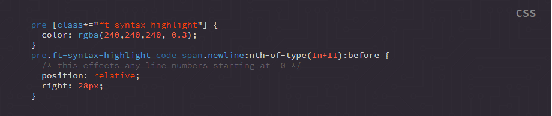

## Supported Tags

Name | Uses
--- | ---
at-rule | @keyframes, @media, @import etc
boolean | true, false (not string literal)
function | calc(), var(), attr(), linear-gradient() etc
property | width, height, font-size, font-weight, padding, margin, margin-left etc.
pseudo | :root, :nth-oftype, :after, :before, :not etc
selector | custom class names, id names 
selector-native | (ul, li, nav, header, h1, h2, h3, span, img, pre, code, meta, title etc)
unit | unit of measure, time, speed etc
url | the value of an href or src tag
variable | custom variables: --background-color: etc
value | the value of a CSS property, provided it's not anything listed above
comment | a CSS comment

## Examples

**Output:**


**Source Code:**
```html
<pre class="ft-syntax-highlight" data-syntax="css" data-syntax-theme="bootstrap" data-showTooltips="true">
  <code>
  <span class="selector-native">pre</span> [<span class="selector">class</span>*="<span class="value">ft-syntax-highlight</span>"] {
    <span class="property">color</span>: <span class="function">rgba</span>(<span class="unit">240</span>,<span class="unit">240</span>,<span class="unit">240</span>, <span class="unit">0.3</span>);
  }
  <span class="selector-native">pre</span>.<span class="selector">ft-syntax-highlight</span> <span class="selector-native">code</span> <span class="selector-native">span</span>.<span class="selector">newline</span><span class="pseudo">:nth-of-type</span>(<span class="unit">1n+11</span>)<span class="pseudo">:before</span> {
    <span class="comment">/* this effects any line numbers starting at 10 */</span>
    <span class="property">position</span>: <span class="value">relative</span>;
    <span class="property">right</span>: <span class="unit">28px</span>;
  }
  </code>
</pre>
```
