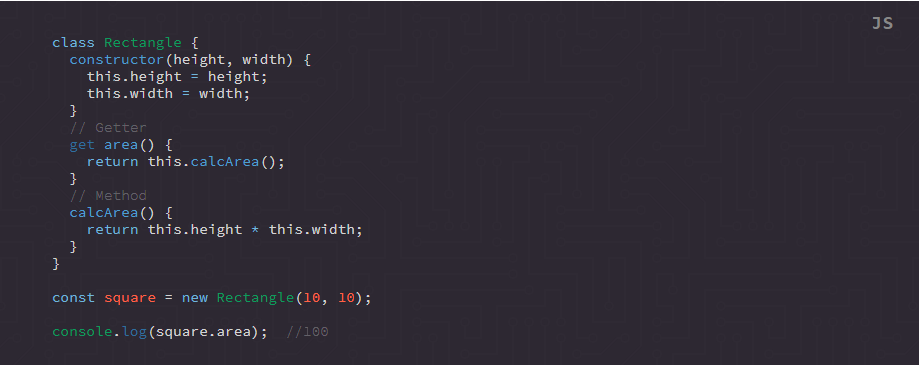

## Supported Tags

Name | Uses
--- | ---
boolean | true, false (not string literal)
identifier | usually used for global variables, local variables, variables as functions etc. Generally, anything that is not listed otherwise here 
identifier-class | the classes name when getting or setting ex: `class <span class="identifier-class">Vehicle</span> {}`
identifier-constant | the constants name, not keyword. ex: `const <span class="identifier-constant">DEBUG_MODE</span> = false`
identifier-native | javascript functions/methods native to the language ex: toLowerCase(), isNaN(), parseInt() etc
identifier-udf | user defined function name
keyword | reserved words: if, then, else, return, var etc
null | undefined, null etc
unit | any unit of measure, time, speed, number etc
object | this is used when referencing an object, not defining. Ex: `var e = []; <span class="object">e</span>.<span class="property">name</span>`
operand | used for almost every operator, simple or compound. ex: ===, !==, ==, +, %, /, etc
parameter | usually best for when defining a UDF with arguments, not so much as referencing. ex: `function multiplyNumbers(<span class="parameter">num1</span>, <span class="parameter">num2</span>)`
property | this is used when referencing an objects property, not defining. If it's a multidimensional object, use `<object><object><property>` for example. Ex: `var e = []; <span class="object">e</span>.<span class="property">name</span>` referencing an objects function for example should be `<object><identifier>` or `<object><identifier-udf>`
url | link value
value | the value of an attribute or identifier
comment | a comment

## Examples

**Output:**


**Source Code:**
```html
<pre class="ft-syntax-highlight" data-syntax="js" data-syntax-theme="bootstrap" data-showTooltips="true">
  <code>
  <span class="keyword">class</span> <span class="identifier-class">Rectangle</span> {
    <span class="identifier">constructor</span>(<span class="parameter">height</span>, <span class="parameter">width</span>) {
      <span class="object">this</span>.<span class="property">height</span> <span class="operand">=</span> height;
      <span class="object">this</span>.<span class="property">width</span> <span class="operand">=</span> width;
    }
    <span class="comment">// Getter</span>
    <span class="identifier-native">get</span> <span class="identifier-udf">area</span>() {
      <span class="keyword">return</span> <span class="object">this</span>.<span class="identifier-udf">calcArea</span>();
    }
    <span class="comment">// Method</span>
    <span class="identifier-udf">calcArea</span>() {
      <span class="keyword">return</span> <span class="object">this</span>.<span class="property">height</span> <span class="operand">*</span> <span class="object">this</span>.<span class="property">width</span>;
    }
  }

  <span class="keyword">const</span> <span class="identifier-constant">square</span> = <span class="keyword">new</span> <span class="identifier-class">Rectangle</span>(<span class="unit">10</span>, <span class="unit">10</span>);

  <span class="identifier-class">console</span>.<span class="identifier-native">log</span>(<span class="object">square</span>.<span class="property">area</span>); <span class="comment"> //100</span>
  </code>
</pre>
```
