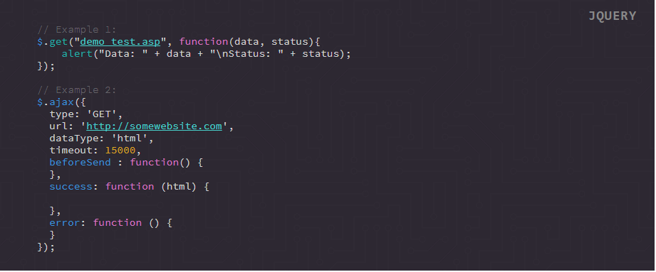

## Supported Tags

Name | Uses
--- | ---
boolean | true, false (not string literal)
identifier | usually used for $ symbols, global variables, local variables, variables as functions etc. Generally, anything that is not listed otherwise here 
identifier-class | the classes name when getting or setting ex: `class <span class="identifier-class">Vehicle</span> {}`
identifier-constant | the constants name, not keyword. ex: `const <span class="identifier-constant">DEBUG_MODE</span> = false`
identifier-native | functions/methods native to the language ex: after(), before(), click(), alert(), get(), ajax() etc etc
identifier-udf | user defined function name
keyword | reserved words: if, then, else, return, var etc
null | undefined, null etc
unit | any unit of measure, time, speed, number etc
object | this is used when referencing an object, not defining. Ex: `var e = []; <span class="object">e</span>.<span class="property">name</span>`
operand | used for almost every operator, simple or compound. ex: ===, !==, ==, +, %, /, etc etc
parameter | usually best for when defining a UDF with arguments. ex: `function multiplyNumbers(<span class="parameter">num1</span>, <span class="parameter">num2</span>)`
property | this is used when referencing an objects property, not defining. If it's a multidimensional object, use `<object><object><property>` for example. Ex: `var e = []; <span class="object">e</span>.<span class="property">name</span>` referencing an objects function for example should be `<object><identifier>` or `<object><identifier-udf>`
url | link value
value | the value of an attribute or identifier
comment | a comment

## Examples

**Output:**


**Source Code:**
```html
<pre class="ft-syntax-highlight" data-syntax="jquery" data-syntax-theme="one-dark" data-showTooltips="true">
  <code>
  <span class="comment">// Example 1:</span>
  <span class="identifier">$</span>.<span class="identifier-native">get</span>("<span class="url">demo_test.asp</span>", <span class="keyword">function</span>(<span class="parameter">data</span>, <span class="parameter">status</span>){
      <span class="identifier-native">alert</span>("Data: " + data + "\nStatus: " + status);
  });

  <span class="comment">// Example 2:</span>
  <span class="identifier">$</span>.<span class="identifier-native">ajax</span>({
    type: 'GET',
    url: '<span class="url">http://somewebsite.com</span>',
    dataType: 'html',
    timeout: <span class="unit">15000</span>,
    <span class="identifier">beforeSend</span> : <span class="keyword">function</span>() {
    },
    <span class="identifier">success</span>: <span class="keyword">function</span> (<span class="parameter">html</span>) {

    },
    <span class="identifier">error</span>: <span class="keyword">function</span> () {
    }
  });
  </code>
</pre>
```
