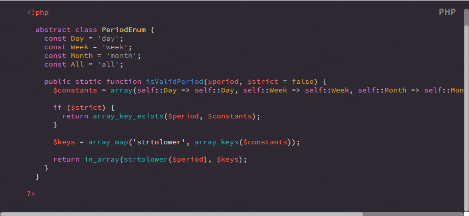

## Supported Tags

Name | Uses
--- | ---
boolean | true, false (not string literal)
identifier | usually used for anything not listed here
identifier-class | the classes name when getting or setting
identifier-constant | the constants name, not keyword or value
identifier-native | functions/methods native to the language ex: echo(), implode(), join(), htmlspecialchars() etc etc
identifier-udf | user defined function name
keyword | lanugage specific reserved words: if, else, return, try, catch etc
null | undefined, null etc
unit | any unit of measure, time, speed, number etc
operand | used for almost every operator, simple or compound. 
parameter | usually best for when defining a UDF with arguments.
typecast | when explicitly casting ex: (int), (boolean) etc
url | link value
value | the value of an attribute
comment | a comment

## Examples

**Output:**


**Source Code:**
```html
<pre class="ft-syntax-highlight" data-syntax="php" data-syntax-theme="one-dark" data-showTooltips="true">
  <code>
  <span class="comment">// example of creating an enum in PHP</span>
  <span class="identifier">&lt;?php</span>

    <span class="keyword">abstract</span> <span class="keyword">class</span> <span class="identifier-class">PeriodEnum</span> {
      <span class="keyword">const</span> <span class="identifier-constant">Day</span> = <span class="value">'day'</span>;
      <span class="keyword">const</span> <span class="identifier-constant">Week</span> = <span class="value">'week'</span>;
      <span class="keyword">const</span> <span class="identifier-constant">Month</span> = <span class="value">'month'</span>;
      <span class="keyword">const</span> <span class="identifier-constant">All</span> = <span class="value">'all'</span>;

      <span class="keyword">public</span> <span class="keyword">static</span> <span class="keyword">function</span> <span class="identifier-udf">isValidPeriod</span>(<span class="identifier">$period</span>, <span class="identifier">$strict</span> <span class="operand">=</span> <span class="boolean">false</span>) {
        <span class="identifier">$constants</span> = <span class="identifier-native">array</span>(<span class="keyword">self</span>::<span class="identifier-constant">Day</span> => <span class="keyword">self</span>::<span class="identifier-constant">Day</span>, <span class="keyword">self</span>::<span class="identifier-constant">Week</span> => <span class="keyword">self</span>::<span class="identifier-constant">Week</span>, <span class="keyword">self</span>::<span class="identifier-constant">Month</span> => <span class="keyword">self</span>::<span class="identifier-constant">Month</span>, <span class="keyword">self</span>::<span class="identifier-constant">All</span> => <span class="keyword">self</span>::<span class="identifier-constant">All</span>);

        <span class="keyword">if</span> (<span class="identifier">$strict</span>) {
          <span class="keyword">return</span> <span class="identifier-native">array_key_exists</span>(<span class="identifier">$period</span>, <span class="identifier">$constants</span>);
        }

        <span class="identifier">$keys</span> = <span class="identifier-native">array_map</span>('strtolower', <span class="identifier-native">array_keys</span>(<span class="identifier">$constants</span>));

        <span class="keyword">return</span> <span class="identifier-native">in_array</span>(<span class="identifier-native">strtolower</span>(<span class="identifier">$period</span>), <span class="identifier">$keys</span>);
      }
    }

  <span class="identifier">?&gt;</span>
  </code>
</pre>
```    
