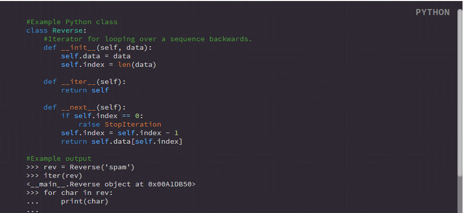

## Supported Tags

Name | Uses
--- | ---
boolean | true, false (not string literal)
identifier | usually used for anything not listed here
identifier-class | the classes name when getting or setting
identifier-constant | the constants name, not keyword or value
identifier-native | functions/methods native to the language ex: str(), sorted(), min(), etc etc
identifier-udf | user defined function name
keyword | lanugage specific reserved words: if, from, and, not, while etc
null | undefined, null etc
unit | any unit of measure, time, speed, number etc
object | when referencing an object, not defining
operand | used for almost every operator, simple or compound.
parameter | usually best for when defining a UDF with arguments.
property | when referencing an objects property, not defining. referencing an objects function for example should be `<object><identifier>` or `<object><identifier-udf>`
url | link value
value | the value of an attribute
comment | a comment

## Examples

**Output:**



**Source Code:**
```html
<pre class="ft-syntax-highlight" data-syntax="python" data-syntax-theme="vbgreen" data-showTooltips="true">
  <code>
  <span class="comment">#Example Python class</span>
  <span class="keyword">class</span> <span class="identifier-class">Reverse</span>:
      <span class="comment">#Iterator for looping over a sequence backwards.</span>
      <span class="keyword">def</span> <span class="identifier-native">__init__</span>(<span class="parameter">self</span>, <span class="parameter">data</span>):
          <span class="identifier">self</span>.<span class="property">data</span> = data
          <span class="identifier">self</span>.<span class="property">index</span> = <span class="identifier-native">len</span>(data)

      <span class="keyword">def</span> <span class="identifier-native">__iter__</span>(<span class="parameter">self</span>):
          <span class="keyword">return</span> <span class="identifier">self</span>

      <span class="keyword">def</span> <span class="identifier-native">__next__</span>(<span class="parameter">self</span>):
          <span class="keyword">if</span> <span class="identifier">self</span>.<span class="property">index</span> <span class="operand">==</span> <span class="unit">0</span>:
              <span class="keyword">raise</span> <span class="identifier-native">StopIteration</span>
          <span class="identifier">self</span>.<span class="property">index</span> = <span class="identifier">self</span>.<span class="property">index</span> - <span class="unit">1</span>
          <span class="keyword">return</span> <span class="identifier">self</span>.<span class="property">data</span>[<span class="identifier">self</span>.<span class="property">index</span>]

  <span class="comment">#Example output</span>
  >>> rev = Reverse('spam')
  >>> iter(rev)
  <__main__.Reverse object at 0x00A1DB50>
  >>> for char in rev:
  ...     print(char)
  ...
  m
  a
  p
  s
  </code>
</pre>
```
