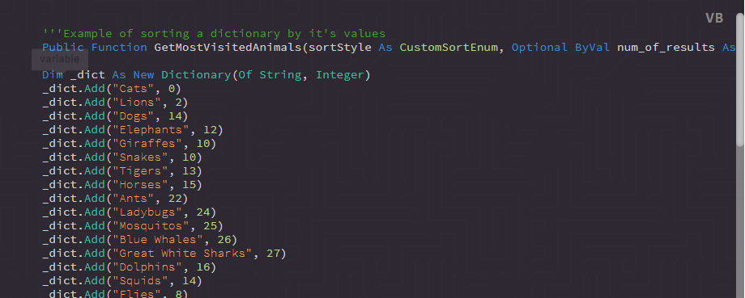

## Supported Tags

Name | Uses
--- | ---
boolean | true, false (not string literal)
identifier | usually used for anything not listed here
identifier-class | the classes name when getting or setting
identifier-constant | the constants name, not keyword or value[s]
identifier-enum | the enums name, not keyword or value[s]
identifier-function | a functions name, native or udf
identifier-namespace | a namespace name, native or user defined
identifier-sub | a subs/methods name, native or user defined
keyword | lanugage specific reserved words: if, else, elseif return, const, enum etc etc
null | undefined, null etc
unit | any unit of measure, time, speed, number etc
operand | used for almost every operator, simple or compound.
parameter | usually best for when defining a UDF with arguments.
property | when referencing an objects property, not defining. referencing an objects function for example should be `<object><identifier-function>` or `<object><identifier-sub>`
typecast | CType(), CInt etc 
url | link value
value | the value of an attribute
variable | used in higher level languages for things like local variables. ex: `Dim <span class="variable">dict</span> As New Dictionary`
comment | a comment

## Examples

**Output:**



**Source Code:**
```html
<pre class="ft-syntax-highlight" data-syntax="VB" data-syntax-theme="vbgreen" data-showTooltips="TRUE">
  <code>
  <span class="comment">'''Example of sorting a dictionary by it's values</span>
  <span class="keyword">Public</span> <span class="keyword">Function</span> <span class="identifier-function">GetMostVisitedAnimals</span>(<span class="parameter">sortStyle</span> <span class="keyword">As</span> <span class="identifier-enum">CustomSortEnum</span>, <span class="keyword">Optional</span> <span class="keyword">ByVal</span> <span class="parameter">num_of_results</span> <span class="keyword">As</span> <span class="identifier-structure">Integer</span> = <span class="unit">1</span>) <span class="keyword">As</span> <span class="identifier-class">Dictionary</span>(<span class="identifier-class">Of String</span>, <span class="identifier-structure">Integer</span>)

  <span class="keyword">Dim</span> <span class="variable">_dict</span> <span class="keyword">As</span> <span class="keyword">New</span> <span class="identifier-class">Dictionary</span>(<span class="identifier-class">Of String</span>, <span class="identifier-structure">Integer</span>)
  <span class="variable">_dict</span>.<span class="identifier-sub">Add</span>(<span class="value">"Cats"</span>, <span class="unit">0</span>)
  <span class="variable">_dict</span>.<span class="identifier-sub">Add</span>(<span class="value">"Lions"</span>, <span class="unit">2</span>)
  <span class="variable">_dict</span>.<span class="identifier-sub">Add</span>(<span class="value">"Dogs"</span>, <span class="unit">14</span>)
  <span class="variable">_dict</span>.<span class="identifier-sub">Add</span>(<span class="value">"Elephants"</span>, <span class="unit">12</span>)
  <span class="variable">_dict</span>.<span class="identifier-sub">Add</span>(<span class="value">"Giraffes"</span>, <span class="unit">10</span>)
  <span class="variable">_dict</span>.<span class="identifier-sub">Add</span>(<span class="value">"Snakes"</span>, <span class="unit">10</span>)
  <span class="variable">_dict</span>.<span class="identifier-sub">Add</span>(<span class="value">"Tigers"</span>, <span class="unit">13</span>)
  <span class="variable">_dict</span>.<span class="identifier-sub">Add</span>(<span class="value">"Horses"</span>, <span class="unit">15</span>)
  <span class="variable">_dict</span>.<span class="identifier-sub">Add</span>(<span class="value">"Ants"</span>, <span class="unit">22</span>)
  <span class="variable">_dict</span>.<span class="identifier-sub">Add</span>(<span class="value">"Ladybugs"</span>, <span class="unit">24</span>)
  <span class="variable">_dict</span>.<span class="identifier-sub">Add</span>(<span class="value">"Mosquitos"</span>, <span class="unit">25</span>)
  <span class="variable">_dict</span>.<span class="identifier-sub">Add</span>(<span class="value">"Blue Whales"</span>, <span class="unit">26</span>)
  <span class="variable">_dict</span>.<span class="identifier-sub">Add</span>(<span class="value">"Great White Sharks"</span>, <span class="unit">27</span>)
  <span class="variable">_dict</span>.<span class="identifier-sub">Add</span>(<span class="value">"Dolphins"</span>, <span class="unit">16</span>)
  <span class="variable">_dict</span>.<span class="identifier-sub">Add</span>(<span class="value">"Squids"</span>, <span class="unit">14</span>)
  <span class="variable">_dict</span>.<span class="identifier-sub">Add</span>(<span class="value">"Flies"</span>, <span class="unit">8</span>)
  <span class="variable">_dict</span>.<span class="identifier-sub">Add</span>(<span class="value">"Cows"</span>, <span class="unit">2</span>)
  <span class="variable">_dict</span>.<span class="identifier-sub">Add</span>(<span class="value">"Squirrels"</span>, <span class="unit">1</span>)
  <span class="variable">_dict</span>.<span class="identifier-sub">Add</span>(<span class="value">"Hummingbirds"</span>, <span class="unit">15</span>)
  <span class="variable">_dict</span>.<span class="identifier-sub">Add</span>(<span class="value">"Hissing Cockroach"</span>, <span class="unit">19</span>)
  <span class="variable">_dict</span>.<span class="identifier-sub">Add</span>(<span class="value">"Sloths"</span>, <span class="unit">41</span>)
  <span class="variable">_dict</span>.<span class="identifier-sub">Add</span>(<span class="value">"Snails"</span>, <span class="unit">99</span>)
  <span class="variable">_dict</span>.<span class="identifier-sub">Add</span>(<span class="value">"Cheetas"</span>, <span class="unit">101</span>)
  <span class="variable">_dict</span>.<span class="identifier-sub">Add</span>(<span class="value">"Grizzly Bears"</span>, <span class="unit">22</span>)
  <span class="variable">_dict</span>.<span class="identifier-sub">Add</span>(<span class="value">"Moose"</span>, <span class="unit">23</span>)

  <span class="keyword">Dim</span> <span class="variable">sortedDictionary</span> <span class="keyword">As</span> <span class="identifier-class">Dictionary</span>(<span class="identifier-class">Of String</span>, <span class="identifier-structure">Integer</span>)
  <span class="comment">'''Clamping numbers only allows numbers within a specificed range.</span>
  <span class="comment">'''   ex: Clamp(val to clamp, min As Integer, max As Integer)</span>
  <span class="variable">num_of_results</span> = <span class="identifier-function">Clamp</span>(<span class="variable">num_of_results</span>, <span class="unit">1</span>, <span class="variable">_dict</span>.<span class="property">Keys</span>.<span class="property">Count</span>)

  <span class="keyword">If</span> <span class="variable">sortStyle</span> = <span class="identifier-enum">CustomSortEnum</span>.<span class="property">Descending</span> <span class="keyword">Then</span>
    <span class="variable">sortedDictionary</span> = <span class="variable">_dict</span>.<span class="identifier-function">OrderByDescending</span>(<span class="keyword">Function</span>(<span class="parameter">p</span>) <span class="parameter">p</span>.<span class="property">Value</span>).<span class="identifier-function">Take</span>(<span class="parameter">num_of_results</span>).<span class="identifier-function">ToDictionary</span>(<span class="keyword">Function</span>(<span class="parameter">p</span>) <span class="parameter">p</span>.<span class="property">Key</span>,<span class="keyword"> Function</span>(<span class="parameter">p</span>) <span class="parameter">p</span>.<span class="property">Value</span>)
  <span class="keyword">Else</span>
    <span class="variable">sortedDictionary</span> = <span class="variable">_dict</span>.<span class="identifier-function">OrderBy</span>(<span class="keyword">Function</span>(<span class="parameter">p</span>) <span class="parameter">p</span>.<span class="property">Value</span>).<span class="identifier-function">Take</span>(<span class="parameter">num_of_results</span>).<span class="identifier-function">ToDictionary</span>(<span class="keyword">Function</span>(<span class="parameter">p</span>) <span class="parameter">p</span>.<span class="property">Key</span>, <span class="keyword">Function</span>(<span class="parameter">p</span>) <span class="parameter">p</span>.<span class="property">Value</span>)
  <span class="keyword">End</span> <span class="keyword">If</span>

  <span class="comment">'''Simply for demonstration purposes,</span>
  <span class="comment">'''this will print the sorted dictionary values in the order desired</span>
  <span class="keyword">For</span> <span class="keyword">Each</span> <span class="variable">kvp</span> <span class="keyword">in</span> <span class="variable">sortedDictionary</span>
    <span class="identifier-class">Console</span>.<span class="identifier-sub">WriteLine</span>(<span class="variable">kvp</span>.Key & " = " & <span class="variable">kvp</span>.Value)
  <span class="keyword">Next</span>

  <span class="keyword">Return</span> <span class="variable">sortedDictionary</span>

  <span class="keyword">End</span> <span class="keyword"><span class="keyword">Function</span></span>

  <span class="comment">'''Example usage:</span>
  <span class="keyword">Call</span> <span class="identifier-function">GetSortedFeatures</span>(<span class="identifier-enum">CustomSortEnum</span>.<span class="property">Ascending</span>, <span class="unit">20</span>)
  </code>
</pre>
```
